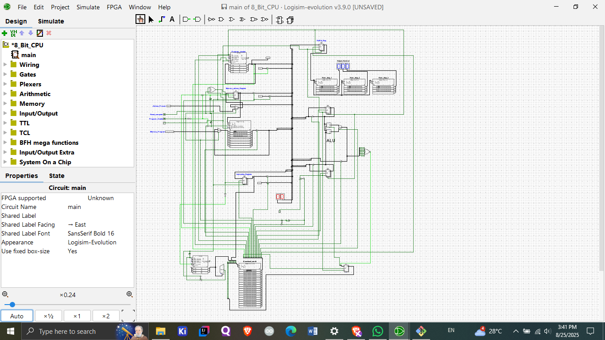

# 🖥️ 8-Bit Computer in Logisim Evolution

This project is an **8-bit computer** designed and simulated in **Logisim Evolution**.  
It demonstrates how a simple microcoded CPU works and drives multiple 8-segment displays as outputs.
# 🖥️ 8-Bit Computer in Logisim Evolution

This project is an **8-bit computer** built entirely in **Logisim Evolution**.  
It demonstrates fundamental computer architecture concepts such as registers, ALU, RAM, control unit, and microcoded execution.  

The computer outputs results to **three 8-segment displays** using three dedicated RAM modules, while a fourth RAM module acts as the **control unit**.

---

## ⚡ Features
🔥 8-Bit CPU in Logisim Evolution

This project demonstrates a custom-built 8-bit CPU designed and simulated in Logisim Evolution.
It includes a basic instruction set, memory, ALU, control unit, and input/output handling.

📌 The project helps understand how a simple processor executes instructions step by step.

🖥️ Features

✅ Custom-built 8-bit CPU architecture
✅ Includes Registers, ALU, Memory & Control Unit
✅ Supports a set of basic instructions
✅ Simulated in Logisim Evolution v3.9.0
✅ Can be extended for learning more advanced CPU design

⚡ Instruction Set (Opcodes)
Mnemonic	Opcode	Description
LDA	0000	Load data into accumulator
ADD	0001	Add value to accumulator
SUB	0010	Subtract value from accumulator
STA	0100	Store accumulator into memory
LDI	0101	Load immediate value into accumulator
JUMP	1100	Jump to address
OUT	1110	Output data
HLT	1111	Halt execution
🛠️ Requirements

To run this project, you need:

Logisim Evolution
 (v3.9.0 or higher)

Java Runtime Environment (JRE) installed

Git (optional, for cloning the repo)

⚙️ Setup & Usage

Clone the repository:

git clone https://github.com/your-username/8bit-cpu.git
cd 8bit-cpu

Open Logisim Evolution

Load the circuit file (main.circ or 8_bit_cpu.circ)

Simulate the circuit using the simulation controls

Load instructions into the RAM / Instruction Register

Run step-by-step or continuous execution to see how the CPU processes instructions

📝 Sample Program

This program will:

Load the value 5 into the accumulator

Add the value 10

Output the result (15)

Halt

Assembly (using our instruction set):
LDI 5       ; Load 5 into accumulator  
ADD 10      ; Add 10 to accumulator  
OUT         ; Output result (15)  
HLT         ; Stop execution  

Machine Code (binary opcodes + operands):
0101 0101   ; LDI 5
0001 1010   ; ADD 10
1110 0000   ; OUT
1111 0000   ; HLT

👉 Load this sequence into RAM in Logisim, and run the simulation to see 15 as the output.

🚀 Future Improvements

Add more instructions (MUL, DIV, CMP, etc.)

Implement stack operations (PUSH, POP)

Add support for interrupts

Design assembler for easier programming

🔥 About

This project was created for learning CPU architecture and understanding how processors execute instructions at the hardware logic level.

## 🔹 License
This project is licensed under the **MIT License** – feel free to use, modify, and share.