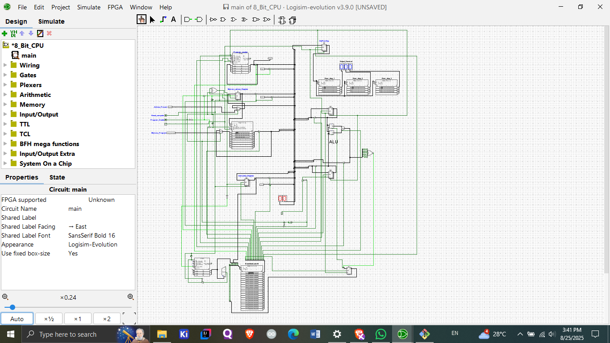

## 🖥️ 8-Bit Computer in Logisim Evolution

This project is a custom 8-bit computer designed and simulated in Logisim Evolution.
It demonstrates the fundamentals of computer architecture such as registers, ALU, RAM, control unit, and microcoded execution.

The computer drives three 8-segment displays as outputs using dedicated RAM modules, while a fourth RAM module acts as the control unit.
 

## ⚡ Features

✅ Custom-built 8-bit CPU architecture

✅ Includes Registers, ALU, Memory, Control Unit

✅ Supports a basic instruction set

✅ Fully simulated in Logisim Evolution v3.9.0

✅ Step-by-step or continuous execution modes

✅ Designed for learning & teaching computer architecture

## ⚙️ Instruction Set (Opcodes)

| Mnemonic | Opcode | Description                           |
| -------- | ------ | ------------------------------------- |
| **LDA**  | 0000   | Load data into accumulator            |
| **ADD**  | 0001   | Add value to accumulator              |
| **SUB**  | 0010   | Subtract value from accumulator       |
| **STA**  | 0100   | Store accumulator into memory         |
| **LDI**  | 0101   | Load immediate value into accumulator |
| **JUMP** | 1100   | Jump to address                       |
| **OUT**  | 1110   | Output data                           |
| **HLT**  | 1111   | Halt execution                        |

## 🛠️ Requirements

To run this project, install:

Logisim Evolution (v3.9.0 or higher)

Java Runtime Environment (JRE)

Git (optional, for cloning the repo)

## 🚀 Setup & Usage

Clone the repository:

git clone https://github.com/Ramakrishna-MN/8-bit-computer-logisim.git
cd 8-bit-computer-logisim

Open Logisim Evolution

Open the circuit file (8_bit_cpu.circ or main.circ)
**Note**:Open with Logisim evolution app only and directly open .circ file 

Load instructions into the output RAM and Control Unit RAM

Run step-by-step or in continuous mode to see instruction execution

## 🖊️ How to Program the Computer

This CPU can be programmed in hardware style, just like vintage computers, by toggling probes instead of editing RAM contents directly.

**Step 1: Switch to Programming Mode** 

Set the Program Enable probe = ON (High)

This allows you to load instructions into RAM instead of executing them

**Step 2: Select the Memory Location**

Use the 4-bit Location Probe to choose the address (0000 – 1111) where the instruction will be stored

**Step 3: Enter the Instruction**

Use the 8-bit Instruction Probe to set the machine code for the instruction

First 4 bits = Opcode

Last 4 bits = Operand (immediate value or memory address)

📌 Example: To load LDI 5 (0101 0101):

Location Probe = 0000

Instruction Probe = 01010101

**Step 4: Write the Instruction**

Tick the Clock once → instruction is stored in RAM at the selected location(one time high and one time low)

**Step 5: Repeat for All Instructions**

Move Location Probe to the next address

Set the next instruction on the 8-bit probe

Tick the Clock to store

📌 Example Program: Add 5 + 10 and output result

| Address | Instruction | Binary   | Explanation             |
| ------- | ----------- | -------- | ----------------------- |
| 0000    | LDI 5       | 01010101 | Load 5 into Accumulator |
| 0001    | ADD 10      | 00011010 | Add 10                  |
| 0010    | OUT         | 11100000 | Output result           |
| 0011    | HLT         | 11110000 | Halt execution          |

**Step 6: Run the Program**

Set Program Enable = OFF (Low) → CPU now switches to execution mode

Start the Clock and tick/auto-run it (ctrl+k)

Watch the Accumulator and Output Display update with results 🎉

📸 Example: Above program outputs 15 on the display

👉 That’s how you “code” for your CPU — by writing in assembly, converting to machine code, then loading it into RAM for execution 🚀

## 🔮 Future Improvements

➕ Add more instructions (MUL, DIV, CMP, etc.)

➕ Implement stack operations (PUSH, POP)

➕ Add interrupt handling

➕ Write an assembler for easier programming

## 🔥 About

This project was created as a learning tool to understand how CPUs work at the hardware logic level using Logisim Evolution.
It’s meant for students, hobbyists, and anyone curious about how a computer processes instructions step by step.

## 📜 License

This project is licensed under the MIT License – free to use, modify, and share.